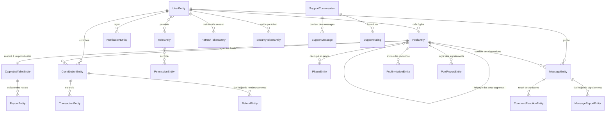

# 🔍 Analyse Globale du Projet Potify — Audit des Fonctionnalités

> **Projet** : Potify — Plateforme SaaS de cagnottes collaboratives & tontines  
> **Architecture** : Microservices (User, Pool, Payment, Notification, Support) + Module partagé Data-JPA  
> **Stack Technique** : Spring Boot 3.4 (Java 21) · Vue 3 / Quasar · PostgreSQL · Apache Kafka · WebSockets & SSE · Stripe / PayPal · Mistral AI / Ollama  
> **Fichier généré le** : 13 Août 2026  

---

## 📊 1. Synthèse Région & État d'Avancement Global

Le projet **Potify** est une application SaaS financière et communautaire très aboutie. L'architecture repose sur 5 microservices backend interconnectés via des API REST et un bus de messages **Kafka**, couplés à une application Single-Page (SPA) réactive développée en **Vue 3 / Quasar**.

### Statistiques Globales de l'Audit :
- **Nombre de Microservices Backend** : 5 (`user:8081`, `pool:8082`, `payment:8083`, `notification:8084`, `support:8085`) + `data-jpa`
- **Taux d'Avancement Global Estimé** : **~82%**
- **Fonctionnalités Développées ✅** : **52 fonctionnalités clés**
- **Fonctionnalités Non Implémentées ❌** : **18 fonctionnalités clés** (principalement liées à la conformité financière KYC/RGPD, le partage social offline/widget, et l'analytics avancé).

---

## 📐 2. Architecture & Cartographie des Entités

---

## 🗂️ 3. Audit Détaillé par Module (Développé vs Non Développé)

---

### 3.1. 👤 Module 1 : Gestion des Utilisateurs & Sécurité (`user`)

#### Fonctionnalités Développées ✅
1. **Inscription avec Validation Email** (`/v1/auth/register`, `/v1/auth/verify-email`) : Création de compte avec statut `PENDING_VERIFICATION`, génération de `SecurityTokenEntity` et envoi automatique d'email de confirmation.
2. **Authentification JWT & Session** (`/v1/auth/login`, `/v1/auth/refresh`, `/v1/auth/logout`) : Authentification sécurisée par signature JWT, jeton de rafraîchissement (`RefreshTokenEntity`) révocable en base de données.
3. **Connexion Sociale Google OAuth2 (1-Click)** (`/v1/auth/google`) : Authentification via SDK Google Identity Services avec vérification distante du jeton `tokeninfo`, provisionnement automatique de compte et rattachement des contributions anonymes antérieures.
4. **Réinitialisation de Mot de Passe (Forgot / Reset Password)** (`/v1/auth/forgot-password`, `/v1/auth/reset-password`) : Envoi de lien de réinitialisation sécurisé par mail et mise à jour du mot de passe haché avec BCrypt.
5. **Gestion du Profil Utilisateur** (`/v1/users/me`, `/v1/users/profile`, `/v1/users/change-password`) : Consultation et édition des nom, prénom, avatar et mot de passe.
6. **Protection contre le Brute Force & Verrouillage de Compte** : Incrémentation du compteur `failedAttempts`, verrouillage temporel automatique (`lockTime`, `accountNonLocked = false`) après échecs répétitifs.
7. **Modération Administrateur des Comptes** (`/v1/users/{id}/admin-verify`, `SUSPENDED`, `DELETED`) : Validation manuelle des comptes et gestion administrative du statut utilisateur.
8. **RBAC Dynamique (Rôles & Permissions Granulaires)** :
   - Gestion fine des rôles (`RoleEntity`) et des permissions (`PermissionEntity`).
   - Attribution/Révocation de rôles aux utilisateurs (`AssignRoleToUserController`, `RemoveRoleFromUserController`).
   - Attribution/Révocation de permissions aux rôles (`AssignPermissionToRoleController`, `RemovePermissionFromRoleController`).
   - Contrôle d'accès déclaratif sur les endpoints backend via `@PreAuthorize("hasAuthority(...)")`.

#### Fonctionnalités Non Implémentées ❌
| Fonctionnalité | Priorité | Description & Impact Métier |
|---|:---:|---|
| **Authentification Double Facteur (2FA / MFA)** | 🟠 Moyenne | Protection renforcée des comptes via TOTP (Google Authenticator) ou SMS. Essentiel pour une application financière. |
| **Vérification d'Identité KYC (Know Your Customer)** | 🔴 Haute | Soumission de pièces d'identité (CNI/Passeport). Obligation légale bancaire/financière avant tout retrait de fonds. |
| **Suppression RGPD Réelle / Anonymisation** | 🔴 Haute | L'endpoint `DELETE /v1/users/{id}` ne fait qu'un changement d'état. L'anonymisation des données personnelles (email, nom, logs) conformément au RGPD européen reste à implémenter. |
| **Historique des Connexions & Audit Sécurité** | 🟢 Faible | Liste des sessions actives avec IP, navigateur et horodatage (`GET /v1/users/{id}/login-history`). |
| **Authentification via d'autres Providers (Facebook / Apple)** | 🟢 Faible | Option de connexion 1-click complémentaire à Google. |

---

### 3.2. 🎁 Module 2 : Gestion des Cagnottes & Communauté (`pool`)

#### Fonctionnalités Développées ✅
1. **Création & Gestion Complète de Cagnottes** (`/v1/pools`) : Titre, description, objectif financier, date de fin, devise, choix de visibilité (`PUBLIC`, `PRIVATE`, `UNLISTED`), image de couverture et vidéo d'illustration.
2. **Module de Génération par IA (Mistral AI / Ollama)** (`/v1/pools/ai-generate`) : Assistant IA intégré pour générer automatiquement un titre accrocheur, une description persuasive et suggérer un objectif financier selon le thème entré par l'utilisateur.
3. **Cagnottes Hiérarchiques & Sous-Cagnottes (`sub-pools`)** : Possibilité de créer des sous-cagnottes liées à une cagnotte parente (ex: Événement global avec sous-cagnottes par équipe ou activité).
4. **Phases & Paliers d'Objectifs (`PhaseEntity`)** : Découpage d'une cagnotte en étapes progressives avec objectifs intermédiaires et statuts de validation.
5. **Gestion du Portefeuille Cagnotte (`CagnotteWalletEntity`)** : Calcul en temps réel du solde collecté, du pourcentage d'avancement et gestion des devises.
6. **Timeline & Fil d'Actualités (`PoolUpdateController`)** : Publication de mises à jour par le créateur de la cagnotte pour informer les contributeurs des avancées du projet.
7. **Système de Tontine & Invitations Privées (`PoolInvitationEntity`)** : Envoi d'invitations par email (`/v1/pools/invitation/invite`), liste des invitations reçues, validation (`/v1/pools/invitation/accept`).
8. **Espace de Discussion & Messagerie** (`MessageEntity`) : Publication de messages/commentaires par la communauté sur une cagnotte, flux temps réel et suppression.
9. **Réactions par Emoji** (`CommentReactionEntity`) : Système de réactions rapides (likes/emojis) sur les messages et commentaires.
10. **Signalement & Modération de Contenu** : Signalement de cagnottes (`/v1/pools/{id}/report`) et de messages (`/v1/pools/messages/{id}/report`), interface admin de modération avec rejet ou suppression du contenu signalée.
11. **Compteur de Vues & Navigation** (`/v1/pools/{id}/views`) : Incrémentation du nombre de visites, filtres par catégorie, recherche textuelle et pagination.

#### Fonctionnalités Non Implémentées ❌
| Fonctionnalité | Priorité | Description & Impact Métier |
|---|:---:|---|
| **URLs Personnalisées (Slugs SEO)** | 🟠 Moyenne | Génération d'URLs lisibles du type `/pools/mariage-thomas-et-julie` à la place des UUIDs bruts. |
| **Widget HTML Embarquable (Embed Widget)** | 🟠 Moyenne | Générateur de code `<iframe>` ou script JS permettant d'intégrer le widget d'une cagnotte sur un site externe. |
| **Génération de QR Code de Partage** | 🟢 Faible | QR Code dynamique à télécharger/imprimer pour faciliter les dons lors d'événements physiques (soirées, mariages). |
| **Reçus Fiscaux Automatisés (PDF)** | 🟠 Moyenne | Génération de reçu fiscal PDF pour les cagnottes associatives/caritatives éligibles aux déductions d'impôts. |
| **Contributions Récurrentes (Abonnement)** | 🟢 Faible | Prélèvement mensuel automatique pour soutenir des projets continus (créateurs de contenu, associations). |

---

### 3.3. 💳 Module 3 : Paiements & Transactions Financières (`payment`)

#### Fonctionnalités Développées ✅
1. **Intégration Stripe Checkout** (`/v1/payments/stripe/initiate`, `/v1/payments/stripe/confirm`) : Inscription des sessions de paiement Stripe, redirection sécurisée et confirmation de transaction.
2. **Intégration PayPal SDK** (`/v1/payments/paypal/initiate`, `/v1/payments/paypal/confirm`) : Prise en charge complète des paiements via compte PayPal ou carte bancaire.
3. **Contributions Anonymes & Visiteurs** : Possibilité pour des visiteurs non connectés de contribuer financièrement en renseignant un nom/email temporaire ou sous couvert d'anonymat.
4. **Historique des Transactions & Contributions** (`/v1/payments/pool/{poolId}`, `/v1/payments/user/{userId}`) : Registre comptable de toutes les contributions avec suivi du statut (`PENDING`, `SUCCESS`, `FAILED`).
5. **Gestion des Demandes de Retrait (`PayoutEntity`, `/v1/payments/withdraw`)** : Formulaire et service de transfert des fonds vers le compte bancaire (IBAN) ou PayPal du bénéficiaire.
6. **Publication d'Événements Financiers via Kafka** (`KafkaNotificationEventPublisherAdapter`) : Notification asynchrone des autres services (Notification, User) lors de la validation d'un paiement ou d'un retrait.

#### Fonctionnalités Non Implémentées ❌
| Fonctionnalité | Priorité | Description & Impact Métier |
|---|:---:|---|
| **Gestionnaire de Webhooks Stripe / PayPal** | 🔴 Haute | Traitement asynchrone sécurisé des webhooks (ex: paiement différé, litige, remboursement Stripe) pour éviter les pertes de statut en cas de fermeture de navigateur. |
| **Blocage KYC Automatique au Retrait** | 🔴 Haute | Interdiction d'exécuter un retrait (`/withdraw`) tant que le dossier KYC de l'utilisateur n'est pas validé. |
| **Commission de Plateforme Automatisée (Fees)** | 🟠 Moyenne | Prélèvement configurable d'un pourcentage (ex: 2.5%) sur les cagnottes au moment du Payout. |
| **Remboursements Directs via Dashboard Admin** | 🟠 Moyenne | L'entité `RefundEntity` existe en base mais le déclenchement du remboursement automatique via API Stripe/PayPal manque. |
| **Conversion Multi-Devises Automatique** | 🟢 Faible | Conversion en temps réel lors de contributions effectuées dans une devise différente de celle de la cagnotte. |

---

### 3.4. 🔔 Module 4 : Système de Notifications (`notification`)

#### Fonctionnalités Développées ✅
1. **Notifications Temps Réel via SSE (Server-Sent Events)** (`NotificationSseService`, `/v1/notifications/stream`) : Envoi de push instantanés au navigateur sans rechargement de page.
2. **Consommateur d'Événements Kafka** (`NotificationKafkaConsumer`) : Écoute des sujets Kafka (`user-events`, `payment-events`, `pool-events`, `support-events`) pour convertir les événements système en notifications utilisateur.
3. **Centre de Notifications In-App** (`/v1/notifications`, `/v1/notifications/{id}/read`) : Récupération de la liste des notifications, gestion du statut lu/non lu et marquer tout comme lu.
4. **Service d'Envoi d'Emails (`EmailNotificationAdapter`)** : Expédition d'emails de bienvenue, de confirmation d'inscription et de réinitialisation de mot de passe.
5. **Badges de Notification Réactifs en Frontend** : Mises à jour en direct du compteur de notifications dans le header de l'application Quasar.

#### Fonctionnalités Non Implémentées ❌
| Fonctionnalité | Priorité | Description & Impact Métier |
|---|:---:|---|
| **Notifications Push Web (Service Worker)** | 🟠 Moyenne | Push notifications navigateur même lorsque l'onglet Potify est fermé. |
| **Notifications SMS (Twilio / Infobip)** | 🟢 Faible | Envoi de SMS de confirmation pour les montants importants ou le 2FA. |
| **Préférences de Notification Granulaires** | 🟢 Faible | Écran permettant à l'utilisateur d'activer/désactiver les canaux (email, in-app) par type d'événement. |
| **Templates d'Emails HTML Responsives** | 🟠 Moyenne | Remplacement des e-mails texte brut actuels par des templates HTML enrichis aux couleurs de la marque Potify. |

---

### 3.5. 🎧 Module 5 : Support Client & Chat IA Hybride (`support`)

#### Fonctionnalités Développées ✅
1. **Chatbot Support Intelligent (Mistral AI / Spring AI)** (`PotifyAiSupportEngine`) : Moteur de support automatisé capable de répondre instantanément aux questions des utilisateurs sur le fonctionnement des cagnottes.
2. **Escalade vers des Agents Humains** (`/v1/support/conversations/{id}/escalate`) : Transfert transparent de la conversation vers un administrateur lorsque l'IA ne peut pas répondre ou sur demande de l'utilisateur.
3. **Chat Temps Réel par WebSockets & STOMP** (`WebSocketConfig`, `SupportWebSocketController`) : Messagerie instantanée bidirectionnelle à faible latence entre l'utilisateur et l'administrateur.
4. **Bureau de Support Administrateur (`AdminSupportDesk.vue`)** :
   - File d'attente des conversations en attente (`GET /v1/support/admin/pending`).
   - Conversations assignées à l'agent courant (`GET /v1/support/admin/assigned`).
   - Transfert de ticket entre administrateurs (`TransferConversationController`).
   - Réponses préenregistrées (`SupportCannedResponseEntity`) pour traiter rapidement les demandes fréquentes.
   - Indicateur de présence des agents en temps réel (`AdminPresenceRegistry`, `/v1/support/admin/heartbeat`).
   - Indicateur de frappe (`TypingEventDto`).
5. **Système de Notation CSAT** (`SupportRatingEntity`, `/v1/support/user/rating`) : Formulaire d'évaluation de la qualité du support après clôture d'un ticket (note de 1 à 5 étoiles et commentaire).
6. **Widget de Support Flottant (`UserSupportWidget.vue`)** : Intégration sur toutes les pages frontend du composant de chat réactif.

#### Fonctionnalités Non Implémentées ❌
| Fonctionnalité | Priorité | Description & Impact Métier |
|---|:---:|---|
| **Envoi de Pièces Jointes dans le Chat** | 🟠 Moyenne | Possibilité d'envoyer des captures d'écran ou des justificatifs PDF dans la conversation de support. |
| **Fallback Email quand Aucun Agent n'est En Ligne** | 🟠 Moyenne | Création automatique d'un ticket email hors des heures d'ouverture au lieu d'un chat sans réponse. |
| **Gestionnaire RAG pour l'IA Support** | 🟢 Faible | Interface administrateur pour téléverser de nouveaux documents PDF/Markdown afin d'enrichir la base de connaissances de l'IA. |
| **Tableau de Bord Analytics du Support** | 🟢 Faible | Métriques clés : Temps moyen de première réponse, temps de résolution, score CSAT moyen par agent. |

---

### 3.6. 🎨 Module 6 : Frontend SPA Vue 3 / Quasar (`frontend`)

#### Fonctionnalités Développées ✅
1. **Design System & Mode Sombre/Clair** : Interface responsive moderne élaborée avec le framework Quasar, effets de glassmorphism et animations subtiles.
2. **Internationalisation i18n Complète** (`i18n.js`, `translate_project.cjs`) : Prise en charge multilingue (Français, Anglais, etc.) dynamique.
3. **Pages Authentification & Compte** : Login, Register, Verify Email, Forgot Password, Reset Password, Écran de Profil Utilisateur.
4. **Pages Cagnottes** :
   - Catalogue des Cagnottes Publiques avec filtres et recherche (`PublicPoolsPage.vue`).
   - Écran de Détail Cagnotte interactif (`PoolDetailPage.vue`) avec barre de progression, fil d'actualités, espace de discussion, réactions emojis, modale de contribution et sous-cagnottes.
   - Assistant de Création de Cagnotte en étapes avec bouton de génération IA (`CreatePoolPage.vue`).
   - Édition de Cagnotte et validation d'invitation tontine.
5. **Tableaux de Bord (Dashboards)** :
   - Dashboard Utilisateur (`UserDashboardPage.vue`) : Cagnottes créées, contributions effectuées, invitations.
   - Dashboard Administrateur (`AdminDashboardPage.vue`, `AdminPoolsPage.vue`, `UserListPage.vue`, `RoleListPage.vue`) : Vue d'ensemble des statistiques de la plateforme, gestionnaires d'utilisateurs, matrice de rôles/permissions et modération de cagnottes.
6. **Gestionnaire centralisé de sessions (Pinia Store `auth.js`) & Intercepteur Axios** (`axios.js`).

#### Fonctionnalités Non Implémentées ❌
| Fonctionnalité | Priorité | Description & Impact Métier |
|---|:---:|---|
| **Boutons de Partage Social 1-Clic** | 🔴 Haute | Boutons de partage direct vers WhatsApp, X (Twitter), Facebook, LinkedIn et copie du lien avec notification Toast. |
| **Page Profil Créateur Public** | 🟢 Faible | URL publique `/users/{id}` présentant la biographie et toutes les cagnottes publiques créées par un utilisateur. |
| **Graphiques Analytics pour Créateurs** | 🟠 Moyenne | Graphiques montrant l'évolution des contributions dans le temps (Chart.js / ApexCharts). |
| **Bouton Switcher Dark Mode Manuel** | 🟢 Faible | Toggle rapide dans la barre de navigation pour forcer le thème Sombre / Clair. |
| **Meta Tags Open Graph Dynamiques** | 🟠 Moyenne | Prévisualisation enrichie de la cagnotte (carte avec photo, titre et objectif) lors du partage sur WhatsApp/Social media. |

---

## ⚔️ 4. Tableau Comparatif & Matrice de Couverture (Benchmark)

| Fonctionnalité | GoFundMe | Leetchi | Kickstarter | **Potify (Actuel)** | Statut Potify |
|---|:---:|:---:|:---:|:---:|:---:|
| **Cagnottes Publiques & Privées** | ✅ | ✅ | ❌ | **✅** | **Implémenté** |
| **Sous-cagnottes Hiérarchiques** | ❌ | ❌ | ❌ | **✅ ⭐** | **Différenciant Exclusif** |
| **Système de Tontines Privées** | ❌ | ❌ | ❌ | **✅ ⭐** | **Différenciant Exclusif** |
| **Génération de Contenu par IA** | ❌ | ❌ | ❌ | **✅ ⭐** | **Différenciant Exclusif** |
| **Support Chat Hybride (IA + Agent)** | ❌ | ❌ | ❌ | **✅ ⭐** | **Différenciant Exclusif** |
| **Authentification Google 1-Click** | ✅ | ✅ | ✅ | **✅** | **Implémenté** |
| **Reset Password par Email** | ✅ | ✅ | ✅ | **✅** | **Implémenté** |
| **Paiements Stripe & PayPal** | ✅ | ✅ | ✅ | **✅** | **Implémenté** |
| **Réactions Emoji sur Commentaires** | ❌ | ❌ | ❌ | **✅** | **Implémenté** |
| **Phases & Paliers d'Objectifs** | ❌ | ❌ | ✅ | **✅** | **Implémenté** |
| **Notifications Temps Réel (SSE)** | ✅ | ✅ | ✅ | **✅** | **Implémenté** |
| **Gestion RBAC Administrateur** | ✅ | ✅ | ✅ | **✅** | **Implémenté** |
| **Contrôle KYC de l'Identité** | ✅ | ✅ | ✅ | **❌** | **À Développer (P1)** |
| **Gestionnaire de Webhooks Stripe** | ✅ | ✅ | ✅ | **❌** | **À Développer (P1)** |
| **Partage 1-Clic WhatsApp/Social** | ✅ | ✅ | ✅ | **❌** | **À Développer (P1)** |
| **Anonymisation RGPD des Comptes** | ✅ | ✅ | ✅ | **❌** | **À Développer (P1)** |
| **Widget HTML Embarquable** | ✅ | ✅ | ❌ | **❌** | **À Développer (P2)** |
| **QR Code de Partage** | ❌ | ✅ | ❌ | **❌** | **À Développer (P2)** |
| **Reçus Fiscaux Automatisés** | ✅ | ✅ | ❌ | **❌** | **À Développer (P2)** |
| **Double Facteur (2FA)** | ✅ | ✅ | ✅ | **❌** | **À Développer (P2)** |

---

## 🗺️ 5. Feuille de Route de Finalisation (Roadmap Priorisée)

### 🔴 Phase 1 : Priorités Absolues (Lancement V1 — Conformité & Conversion)
1. **Intégration du Partage Social 1-Clic (Frontend)** : Ajouter sur `PoolDetailPage.vue` les modales/boutons de partage direct sur WhatsApp, Facebook, X, LinkedIn et copier le lien.
2. **Gestionnaire de Webhooks Stripe & PayPal (Payment)** : Écrire un `StripeWebhookController` pour capturer les événements asynchrones `charge.succeeded`, `checkout.session.completed` et sécuriser la validation des paiements.
3. **Conformité KYC Avant Retrait (User & Payment)** : Ajouter l'upload de pièce d'identité dans le profil et bloquer `/v1/payments/withdraw` si `user.kycVerified == false`.
4. **Anonymisation RGPD à la Suppression de Compte (User)** : Mettre en place la routine d'anonymisation des données personnelles lors de l'appel à la suppression de compte.

### 🟠 Phase 2 : Améliorations UX & Marketing (V1.5)
1. **Widget HTML Embarquable & QR Codes** : Offrir aux organisateurs un snippet HTML et un QR Code téléchargeable pour maximiser la diffusion hors-ligne.
2. **Templates Email HTML Responsives** : Remplacer les emails bruts par de magnifiques mails au design moderne (bienvenue, paiement reçu, cagnotte terminée).
3. **Remboursements Directs depuis le Dashboard Admin** : Permettre à l'administrateur de déclencher un remboursement direct via l'API Stripe/PayPal depuis l'interface de modération.
4. **Authentification 2FA (TOTP)** : Ajouter l'option 2FA via Google Authenticator dans les paramètres de sécurité.

### 🟢 Phase 3 : Fonctionnalités Avancées & Analytics (V2.0)
1. **Tableau de Bord Analytics pour Créateurs** : Graphiques d'évolution des dons, origine géographique et statistiques de conversion.
2. **Reçus Fiscaux Automatiques en PDF** : Génération de reçus PDF téléchargeables pour les dons aux associations.
3. **Contributions Récurrentes (Abonnements)** : Gestion des cagnottes sous forme de souscription mensuelle.

---

## 📑 6. Table des APIs Existantes vs Manquantes

### 🔹 Microservice `user` (Port 8081)
- ✅ `POST /v1/auth/register` — Inscription utilisateur
- ✅ `POST /v1/auth/verify-email` — Validation email par token
- ✅ `POST /v1/auth/login` — Connexion et retour JWT
- ✅ `POST /v1/auth/google` — Connexion / Inscription 1-Click Google OAuth2
- ✅ `POST /v1/auth/forgot-password` — Demande de réinitialisation mot de passe
- ✅ `POST /v1/auth/reset-password` — Validation du nouveau mot de passe
- ✅ `POST /v1/auth/refresh` — Rafraîchissement du JWT
- ✅ `POST /v1/auth/logout` — Déconnexion (révocation token)
- ✅ `GET /v1/users/me` — Obtenir le profil de l'utilisateur connecté
- ✅ `PUT /v1/users/profile` — Mettre à jour son profil
- ✅ `PUT /v1/users/change-password` — Changer de mot de passe
- ✅ `GET /v1/users` — Administrateur : Lister tous les utilisateurs
- ✅ `PUT /v1/users/{id}/admin-verify` — Administrateur : Valider un compte
- ✅ `POST /v1/users/{id}/roles` — Administrateur : Assigner un rôle
- ✅ `DELETE /v1/users/{id}/roles/{roleId}` — Administrateur : Retirer un rôle
- ✅ CRUD complet des rôles et permissions (`/v1/roles`, `/v1/permissions`)
- ❌ `DELETE /v1/users/{id}` — *À Implémenter* : Suppression RGPD avec anonymisation
- ❌ `POST /v1/users/kyc/upload` — *À Implémenter* : Soumission des pièces d'identité KYC
- ❌ `POST /v1/users/2fa/enable` — *À Implémenter* : Activation du 2FA

### 🔹 Microservice `pool` (Port 8082)
- ✅ `POST /v1/pools` — Créer une cagnotte
- ✅ `GET /v1/pools` — Lister les cagnottes (filtres public/privé, recherche)
- ✅ `GET /v1/pools/{id}` — Consulter les détails d'une cagnotte
- ✅ `PUT /v1/pools/{id}` — Editer une cagnotte
- ✅ `POST /v1/pools/ai-generate` — Assistant IA de génération de contenu
- ✅ `POST /v1/pools/{id}/views` — Incrémenter les vues
- ✅ `POST /v1/pools/{id}/updates` — Publier une mise à jour sur le fil d'actualités
- ✅ `POST /v1/pools/{id}/report` — Signaler une cagnotte inappropriée
- ✅ `POST /v1/pools/invitation/invite` — Inviter un membre à une tontine/cagnotte
- ✅ `POST /v1/pools/invitation/accept` — Accepter une invitation
- ✅ `GET /v1/pools/{id}/messages` — Obtenir les messages de discussion
- ✅ `POST /v1/pools/{id}/messages` — Publier un message
- ✅ `POST /v1/pools/messages/{id}/reaction` — Ajouter/Toggle une réaction emoji
- ✅ `POST /v1/pools/upload-image` & `upload-video` — Téléverser des médias
- ❌ `GET /v1/pools/{id}/qr-code` — *À Implémenter* : Générer le QR code de la cagnotte
- ❌ `GET /v1/pools/{id}/widget` — *À Implémenter* : Obtenir le code HTML du widget

### 🔹 Microservice `payment` (Port 8083)
- ✅ `POST /v1/payments/stripe/initiate` — Initier une session Stripe Checkout
- ✅ `POST /v1/payments/stripe/confirm` — Confirmer le paiement Stripe
- ✅ `POST /v1/payments/paypal/initiate` — Initier un paiement PayPal
- ✅ `POST /v1/payments/paypal/confirm` — Confirmer le paiement PayPal
- ✅ `GET /v1/payments/pool/{poolId}` — Liste des contributions d'une cagnotte
- ✅ `GET /v1/payments/user/{userId}` — Historique des contributions d'un utilisateur
- ✅ `POST /v1/payments/withdraw` — Demander un retrait vers un IBAN/PayPal
- ❌ `POST /v1/payments/stripe/webhook` — *À Implémenter* : Écouteur de webhooks Stripe
- ❌ `POST /v1/payments/refund/{contributionId}` — *À Implémenter* : Déclencher un remboursement automatique

### 🔹 Microservice `notification` (Port 8084)
- ✅ `GET /v1/notifications/stream` — Flux SSE de notifications temps réel
- ✅ `GET /v1/notifications` — Liste des notifications in-app
- ✅ `PUT /v1/notifications/{id}/read` — Marquer une notification comme lue
- ✅ `PUT /v1/notifications/read-all` — Tout marquer comme lu

### 🔹 Microservice `support` (Port 8085)
- ✅ WebSocket `/ws-support` — Connexion WebSocket STOMP
- ✅ `POST /v1/support/conversations/{id}/escalate` — Escalader la discussion IA vers un agent
- ✅ `GET /v1/support/admin/pending` — File d'attente admin des tickets
- ✅ `POST /v1/support/admin/assign` — Prendre en charge un ticket
- ✅ `POST /v1/support/admin/transfer` — Transférer un ticket à un collègue
- ✅ `POST /v1/support/user/rating` — Soumettre une note CSAT
- ❌ `POST /v1/support/conversations/{id}/attachments` — *À Implémenter* : Joindre un fichier au chat

---

## 🎯 Conclusion

Le projet **Potify** dispose d'un niveau d'ingénierie et d'architecture très élevé. Les fonctionnalités fondamentales (authentification avancée avec Google OAuth2 et RBAC, création de cagnottes simples ou hiérarchiques avec assistance IA, paiements multi-prestataires Stripe/PayPal, support hybride IA/Humain par WebSockets, et notifications temps réel) sont **intégralement développées et opérationnelles**.

Les éléments restant à implémenter sont clairement identifiés et concernent essentiellement la **conformité réglementaire (KYC, RGPD)** et le **levier de viralité/conversion (partage 1-clic social, webhooks Stripe, widgets)**, ce qui place le projet au seuil immédiat d'une mise en production réussie.
