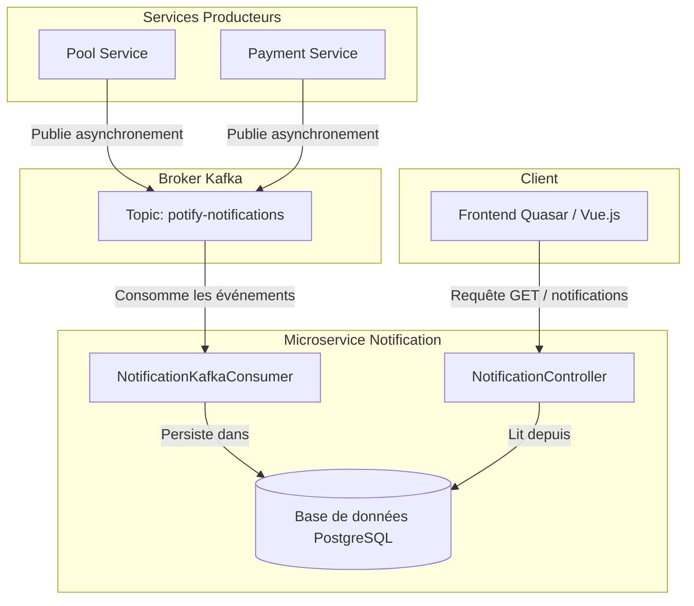

# Microservice de Notification - Documentation Technique

Ce document décrit en détail l'architecture, le flux événementiel et le fonctionnement interne du microservice de notification de l'écosystème **Potify**.

---

## 1. Vue d'ensemble

Le microservice de notification est un service centralisé et découplé, responsable de la réception, de la persistance et de la distribution des notifications à destination des utilisateurs de la plateforme. 

Pour garantir une expérience fluide et éviter d'impacter les performances des services métiers (comme le service de cagnotte ou de paiement), le système s'appuie sur une **architecture événementielle (Event-Driven Architecture)** avec **Apache Kafka**.



---

## 2. Flux Événementiel Kafka

### Publication (Producteurs)
Lorsqu'un événement métier survient (un utilisateur ajoute un commentaire, réagit à un message, fait un don ou envoie une invitation), le service concerné publie un événement de manière **asynchrone** (via un `CompletableFuture.runAsync` dans `KafkaNotificationEventPublisherAdapter`) sur le topic Kafka `potify-notifications`.

**Exemple de Payload JSON envoyé :**
```json
{
  "userId": "a30680f3-1664-4cf8-bba6-ff8e16accec3",
  "type": "REACTION",
  "title": "Nouvelle réaction !",
  "content": "Quelqu'un a réagi à votre message sur la cagnotte 'Mon projet'.",
  "channel": "NOTIF_APP"
}
```

### Consommation (Service Notification)
Le microservice de notification écoute en continu le topic à l'aide de `NotificationKafkaConsumer`.
Il s'appuie sur un système de désérialisation résilient (`ErrorHandlingDeserializer`) pour éviter le blocage de la file (effet Poison Pill) en cas de message malformé :

*   **Désérialiseur de clé** : `StringDeserializer`
*   **Désérialiseur de valeur** : `JsonDeserializer` (mappé vers un type `java.util.Map`)

---

## 3. Architecture Interne (Clean Architecture / DDD)

Le microservice est structuré selon les principes de la Clean Architecture :

### A. Couche Domaine (Domain Model)
*   **`Notification`** : Modèle métier pur représentant une notification contenant l'identifiant utilisateur (`userId`), le type, le titre, le contenu, le canal, le statut (`ACTIVE` ou `COMPLETED`) et la date de création.
*   **`NotificationType`** *(dans data-jpa)* : Enumération listant les types de notifications gérés :
    *   `MESSAGE` : Nouveau commentaire sur une cagnotte.
    *   `CONTRIBUTION` : Don/participation effectué sur une cagnotte.
    *   `REACTION` : Ajout d'une réaction (Like, Heart, Pray) sur un message.
    *   `INVITATION` : Invitation reçue pour rejoindre une cagnotte.

### B. Couche Application (Services)
*   **`CreateNotificationService`** : Contient la logique d'initialisation par défaut d'une notification (statut initial `ACTIVE`, date de création automatique à `Instant.now()`) puis appelle le port de persistance.
*   **`NotificationRepositoryPort`** : Interface définissant les opérations d'accès aux données.

### C. Couche Infrastructure (Adaptateurs)
*   **`NotificationKafkaConsumer` (Primaire)** : Écoute les événements Kafka, crée le modèle domaine `Notification` et exécute le service de création.
*   **`NotificationController` (Primaire)** : Expose les routes REST pour l'application frontend.
*   **`NotificationJpaAdapter` (Secondaire)** : Implémente le port du repository en effectuant le mapping entre le modèle domaine `Notification` et l'entité JPA `NotificationEntity`.

---

## 4. Résilience & Résolution des Contraintes DB

### Problématique de l'évolution des Enums
Par défaut, lorsque Hibernate génère le schéma de la base de données, il crée une contrainte de validation de type **CHECK** sur PostgreSQL pour les champs énumérés (ex: `notifications_type_check` restreignant la colonne `type` aux valeurs de départ).
Lorsqu'un nouvel élément est ajouté à l'énumération Java (`REACTION` ou `INVITATION`), PostgreSQL refuse les insertions de ces nouveaux types car la contrainte DB n'est pas modifiée automatiquement par `ddl-auto: update`.

### Solution de Nettoyage au démarrage
Pour y pallier, une méthode automatisée a été introduite dans `NotificationApplication.java` :
```java
@Bean
public CommandLineRunner dropConstraint(JdbcTemplate jdbcTemplate) {
    return args -> {
        try {
            jdbcTemplate.execute("ALTER TABLE notifications DROP CONSTRAINT IF EXISTS notifications_type_check");
        } catch (Exception e) {
            // Log d'avertissement en cas d'erreur
        }
    };
}
```
Cette routine supprime la contrainte CHECK PostgreSQL obsolète au démarrage, ce qui permet à l'application d'insérer dynamiquement tous les nouveaux types de notification déclarés dans le code.

---

## 5. Endpoints de l'API REST

L'API est sécurisée et permet au Frontend de requêter les données de l'utilisateur :

| Méthode | Route | Description |
| :--- | :--- | :--- |
| **GET** | `/api/notifications/user/{userId}` | Récupère toutes les notifications d'un utilisateur donné (ordonnées de la plus récente à la plus ancienne). |
| **PUT** | `/api/notifications/{id}/read` | Marque une notification spécifique comme lue en passant son statut à `COMPLETED`. |
