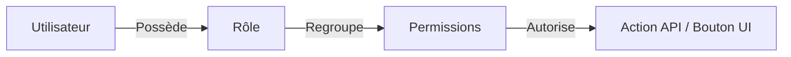

# Implémentation du Contrôle d'Accès Basé sur les Rôles (RBAC) - Potify

Ce document détaille l'architecture et les protocoles de sécurité mis en place pour gérer les habilitations et les rôles (RBAC - Role-Based Access Control) au sein de l'application Potify. Il est structuré pour servir de support explicatif clair et professionnel pour votre encadrant.

---

## 1. Vue d'Ensemble de l'Architecture RBAC

Le contrôle d'accès dans Potify repose sur le principe **RBAC (Role-Based Access Control)**. 
Au lieu d'associer directement des permissions à un utilisateur, nous utilisons une structure intermédiaire :
1. **Permissions** : Les droits d'actions élémentaires (ex: `POOL_SUSPEND`, `PAYMENT_CONFIRM`, `MESSAGE_DELETE`).
2. **Rôles** : Un ensemble logique de permissions (ex: `ADMIN_POOL`, `MODERATEUR`, `SUPER_ADMIN`).
3. **Utilisateurs** : Les utilisateurs physiques, auxquels on attribue un ou plusieurs rôles.



---

## 2. Modèle de Données (Base de Données relationnelle JPA)

Le modèle de sécurité utilise cinq tables principales dans la base de données relationnelle (gérée via **Spring Data JPA**) :

1. **`users`** : Stocke les informations de l'utilisateur (email, mot de passe encodé en BCrypt, statut actif/bloqué).
2. **`roles`** : Liste les rôles disponibles (`SUPER_ADMIN`, `ADMIN_POOL`, `ADMIN_PAYMENT`, `MODERATEUR`, `USER`).
3. **`permissions`** : Contient les privilèges granulaires (ex: `POOL_VALIDATE`, `PAYMENT_READ`).
4. **`user_roles`** : Table de jointure reliant un utilisateur à ses rôles (relation Many-to-Many).
5. **`role_permissions`** : Table de jointure reliant un rôle à ses permissions (relation Many-to-Many).

---

## 3. Sécurité Backend : Spring Security & JWT

Le backend Spring Boot protège ses ressources de manière sans état (**stateless**) en utilisant le protocole **JWT (JSON Web Token)**.

### A. Flux d'Authentification et Protocole JWT
1. **Connexion** : L'utilisateur soumet ses identifiants au microservice `user`.
2. **Génération du Token** : Si les identifiants sont corrects, le backend génère un token JWT signé avec une clé secrète contenant :
   * Le sujet (`sub`) : l'adresse email de l'utilisateur.
   * Les revendications (**claims**) : la liste des rôles de l'utilisateur (ex: `["ROLE_ADMIN_POOL"]`).
3. **Vérification** : À chaque requête HTTP ultérieure, le client (frontend) envoie ce jeton dans l'en-tête HTTP :
   `Authorization: Bearer <token>`
4. **Extraction** : Le filtre de sécurité extrait le token, vérifie sa signature cryptographique, charge les rôles de l'utilisateur dans le contexte de sécurité Spring Security (`SecurityContextHolder`).

### B. Sécurisation fine avec `@PreAuthorize`
Les endpoints API des microservices sont protégés par des annotations Spring Security vérifiant soit le rôle global, soit la permission spécifique :

* **Exemple sur la suspension d'une cagnotte (`PoolWorkflowController.java`) :**
  ```java
  @PostMapping("/{id}/suspend")
  @PreAuthorize("hasAuthority('POOL_SUSPEND') or hasRole('SUPER_ADMIN') or hasRole('MODERATEUR')")
  public ResponseEntity<PoolResponse> suspend(@PathVariable String id, @RequestBody ReasonRequest request) {
      // Logique métier
  }
  ```
  *Ici, l'accès est autorisé si l'utilisateur possède directement la permission granulaire `POOL_SUSPEND` ou l'un des rôles majeurs `SUPER_ADMIN` ou `MODERATEUR`.*

---

## 4. Initialisation Automatisée des Rôles & Comptes (`DataInitializer.java`)

Pour garantir la conformité et faciliter les tests, la classe Spring `@Component` `DataInitializer` s'exécute automatiquement au démarrage de l'application (`CommandLineRunner`) :
* Elle crée les permissions si elles sont absentes.
* Elle crée les rôles et leur affecte leur ensemble de permissions respectif.
* Elle crée des comptes utilisateurs par défaut avec des mots de passe hachés de manière sécurisée en **BCrypt** :

| Compte de test | Rôle Principal | Rôle Spring Security | Permissions Associées |
| :--- | :--- | :--- | :--- |
| **`superadmin@potify.com`** | `SUPER_ADMIN` | `ROLE_SUPER_ADMIN` | Toutes les permissions (`ALL`) |
| **`pooladmin@potify.com`** | `ADMIN_POOL` | `ROLE_ADMIN_POOL` | `POOL_READ`, `POOL_VALIDATE`, `POOL_SUSPEND`, `POOL_ARCHIVE` |
| **`moderator@potify.com`** | `MODERATEUR` | `ROLE_MODERATEUR` | `REPORT_READ`, `REPORT_RESOLVE`, `MESSAGE_DELETE` |
| **`paymentadmin@potify.com`** | `ADMIN_PAYMENT` | `ROLE_ADMIN_PAYMENT` | `PAYMENT_READ`, `PAYMENT_CONFIRM`, `PAYMENT_REFUND`, `EXPORT_FINANCIAL` |
| **`user@potify.com`** | `USER` | `ROLE_USER` | `POOL_CREATE`, `POOL_UPDATE_OWN`, `CONTRIBUTION_CREATE` |

---

## 5. Sécurité Frontend : Vue 3, Quasar & Pinia Store

Le frontend gère l'affichage dynamique et protège l'expérience utilisateur en fonction des rôles décodés du token JWT.

### A. Décodage du Jeton et Habilitations Réactives (`auth.js` / Store)
Lorsqu'un utilisateur se connecte, le store d'authentification stocke le token et calcule des variables booléennes réactives grâce à `computed()` :

```javascript
export const authStore = {
  user: computed(() => state.user),
  isAdmin: computed(() => state.user?.roles?.includes('ROLE_SUPER_ADMIN')),
  isModerator: computed(() => state.user?.roles?.includes('ROLE_MODERATEUR') || state.user?.roles?.includes('ROLE_SUPER_ADMIN')),
  isPoolAdmin: computed(() => state.user?.roles?.includes('ROLE_ADMIN_POOL') || state.user?.roles?.includes('ROLE_SUPER_ADMIN')),
  isPaymentAdmin: computed(() => state.user?.roles?.includes('ROLE_ADMIN_PAYMENT') || state.user?.roles?.includes('ROLE_SUPER_ADMIN'))
}
```

### B. Affichage Dynamique dans le Dashboard (`AdminPoolsPage.vue`)
L'interface s'adapte dynamiquement en fonction du rôle de l'utilisateur connecté :

1. **Affichage des Onglets Modérateur / Administrateur :**
   ```html
   <div v-if="authStore.isModerator.value || authStore.isPoolAdmin.value" class="q-mb-md">
     <q-tabs v-model="activeTab">
       <q-tab name="pools" label="Cagnottes" />
       <!-- Seuls les modérateurs voient le signalement de commentaires -->
       <q-tab name="reports" label="Messages Signalés" v-if="authStore.isModerator.value" />
       <q-tab name="poolReports" label="Cagnottes Signalées" />
       <q-tab name="suspendedPools" label="Cagnottes Suspendues" />
     </q-tabs>
   </div>
   ```

2. **Actions de Modération sur les Cagnottes :**
   Les boutons pour suspendre, rétablir ou modifier les frais d'une cagnotte vérifient la propriété calculée `canManagePools` :
   ```javascript
   const canManagePools = computed(() => {
     return authStore.isSuperAdmin.value || authStore.isPoolAdmin.value
   })
   ```
   ```html
   <!-- Bouton de suspension visible uniquement si l'utilisateur a les droits requis -->
   <q-btn v-if="canManagePools" icon="pause" @click="changeStatus(props.row, 'SUSPENDUE')" />
   ```

---

## 6. Résumé pour votre Encadrant

> **Protocoles et Outils Majeurs utilisés :**
> - **BCrypt** : Algorithme de hachage robuste à salage adaptatif utilisé pour sécuriser les mots de passe stockés en base de données.
> - **JWT (JSON Web Token)** : Protocole d'échange de jetons sécurisés sans état (Stateless) pour identifier les utilisateurs et transporter leurs rôles.
> - **Spring Security** : Framework Java de sécurité robuste gérant le filtre des requêtes HTTP, la validation cryptographique des JWT et le contrôle d'accès programmatique et déclaratif (`@PreAuthorize`).
> - **JPA / Hibernate** : Mapping Objet-Relationnel (ORM) assurant la persistance des entités (User, Role, Permission) et la cohérence relationnelle.
> - **Vue 3 / Quasar / Reactive API** : Framework frontend de pointe fournissant le rendu conditionnel (`v-if`) basé sur les rôles de l'utilisateur connecté décodés du JWT.
